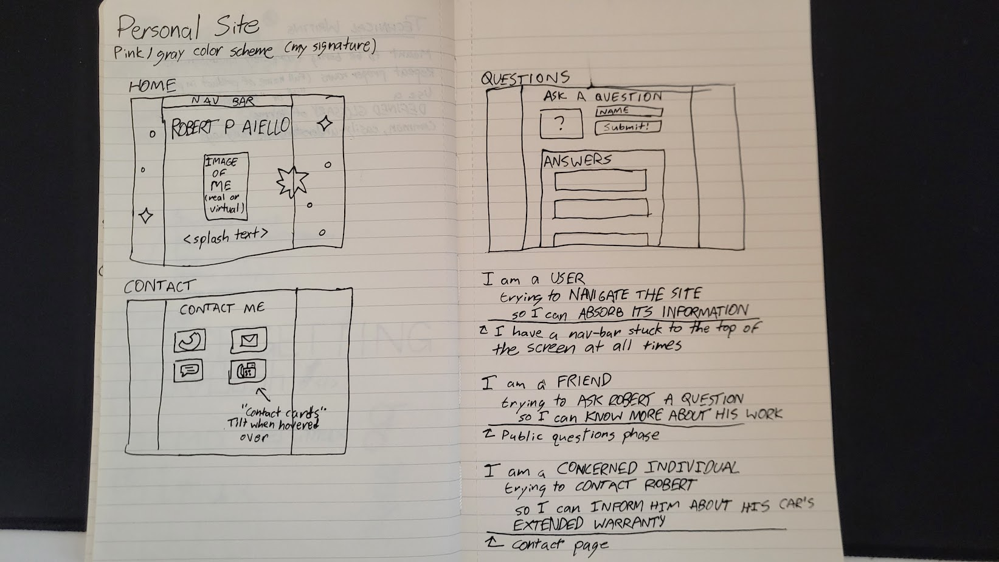

# project-1
### Robert Aiello
#### Project 1: Personal website

A fun, visually interesting, not-so-professional personal website made to look like someone's MySpace page from 2010.
Includes five pages linked by a nav-bar:
* A home page with random text every time you refresh the page
* A projects page showcasing cool stuff I've done
* A contact page holding all of my contact info
* An "ask me a question" page in the vein of Bill Wurtz

Uses a central "style.css" file as well as a superlight version of Bootstrap with just the grid system (no JS components or colors or text styling)

